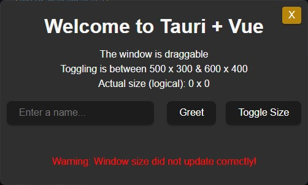
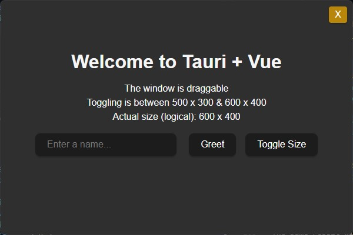

# Tauri v2 borderless size bug

- Toggle Size button toggles logical size between 500 x 300 and 600 x 400 pixels. It doesn't work.



Package versions are fixed to the latest generated by `create-tauri-app` (as of 04 Jan 2025 12:00 UTC).

**src-tauri/Cargo.toml**:
```toml
tauri-build = "2.0.4"
tauri = "2.2.0"
tauri-plugin-shell = "2.2.2"
tauri-plugin = "2.0.4"
tauri-utils = "2.1.1"
tao = "0.31.0"
```

**package.json**:
```json
{
    "@tauri-apps/api": "2.2.0",
    "@tauri-apps/plugin-shell": "2.2.0",
    "@tauri-apps/cli": "2.2.2",
}
```

tauri info:
```bash
npm run tauri info

> window-size@0.1.0 tauri
> tauri info

[✔] Environment
    - OS: Windows 10.0.22631 x86_64 (X64)
    ✔ WebView2: 131.0.2903.112
    ✔ MSVC: Visual Studio Professional 2022
    ✔ rustc: 1.82.0 (f6e511eec 2024-10-15)
    ✔ cargo: 1.82.0 (8f40fc59f 2024-08-21)
    ✔ rustup: 1.27.1 (54dd3d00f 2024-04-24)
    ✔ Rust toolchain: stable-x86_64-pc-windows-msvc (default)
    - node: 20.11.1
    - npm: 10.2.4
    - bun: 1.1.30

[-] Packages
    - tauri 🦀: 2.2.0
    - tauri-build 🦀: 2.0.4
    - wry 🦀: 0.48.0
    - tao 🦀: 0.31.0
    - @tauri-apps/api : 2.2.0
    - @tauri-apps/cli : 2.2.2

[-] Plugins
    - tauri-plugin-shell 🦀: 2.2.0
    - @tauri-apps/plugin-shell : 2.2.0

[-] App
    - build-type: bundle
    - CSP: unset
    - frontendDist: ../dist
    - devUrl: http://localhost:1420/
    - framework: Vue.js
    - bundler: Vite
```


## When it worked last time



Replace the contents of **Cargo.toml** with:

```toml
[build-dependencies]
tauri-build = { version = "=2.0.2", features = [] }

[dependencies]
tauri = { version = "=2.0.6", features = [] }
tauri-plugin-shell = "=2.0.2"
tauri-plugin = "=2.0.2"
tauri-utils = "=2.0.2"
tao = "=0.30.5"
serde = { version = "1", features = ["derive"] }
serde_json = "1"
```

Update the **package.json**:
```json
{
  "dependencies": {
    "vue": "^3.3.4",
    "@tauri-apps/api": "2.0.3",
    "@tauri-apps/plugin-shell": "2.0.1"
  },
  "devDependencies": {
    "@vitejs/plugin-vue": "^5.0.5",
    "typescript": "^5.2.2",
    "vite": "^5.3.1",
    "vue-tsc": "^2.0.22",
    "@tauri-apps/cli": "2.0.4"
  }
}
```

The same result will be if we fix all tauri packages to 2.0.0.

Previously (see [previous commit](https://github.com/stolnikov/tauri-borderless-size/tree/015e30e40280964bad2a786ddda46519cb5da6d7)), updating tao to `=0.30.6` and onwards would create the borderless window of the wrong initial size, that couldn't be set.

- Tauri 2.1.0 and 2.1.1 depend on `tauri-runtime-wry = ^2.2.0` that depends on `tao = ^0.30.6`
- Tauri 2.0.6 depends on `tauri-runtime-wry = ^2.1.2` that depends on `tao = ^0.30.2`

Clean up and run:
```
cd src-tauri; cargo clean; cd ..;
npm i; npm run tauri dev
```